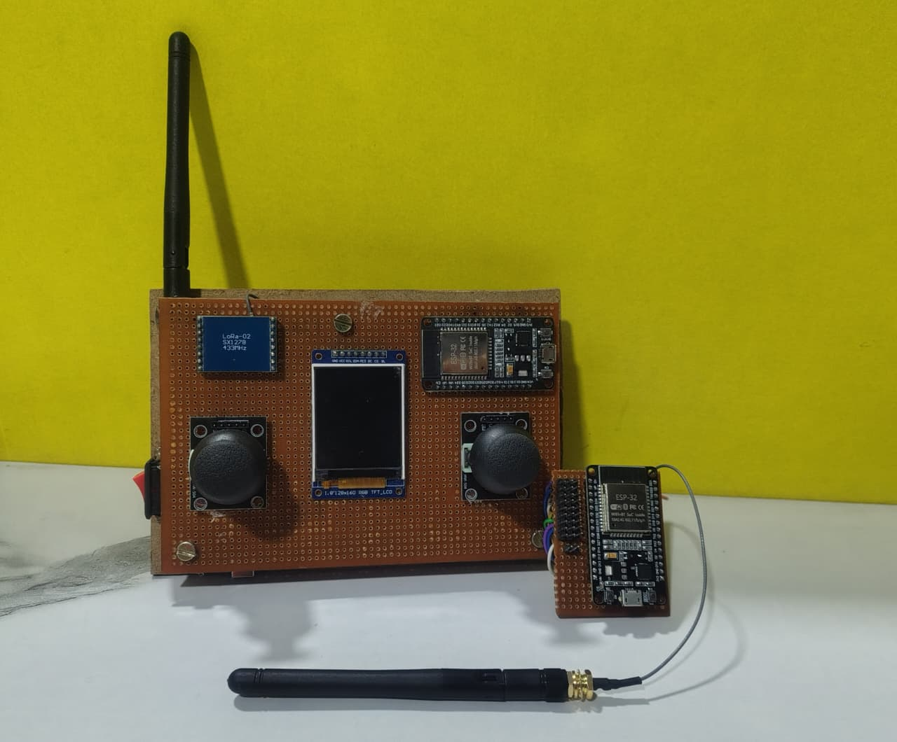

# AeroLink - Wireless Transmitter and Receiver System for RC Aircraft Control

##  Project Overview

AeroLink is a custom-built long-range wireless transmitter and receiver system developed using ESP32 and SX1278 LoRa (433 MHz) modules. The system enables reliable wireless control of RC aircraft, drones, rovers, and robotic platforms.

The transmitter reads joystick inputs, displays real-time control information on a TFT display, and sends commands wirelessly through LoRa communication. The receiver processes incoming commands and controls servos, ESCs, and DC motors while providing failsafe protection against signal loss.

---

##  Features

- Long-range wireless communication using LoRa (433 MHz)
- ESP32-based transmitter and receiver
- Automatic transmitter-receiver binding
- Real-time TFT display monitoring
- Dual joystick control
- Control of:
  - 2 Servo Motors
  - 2 ESC (Electronic Speed Controller)
- Signal-loss failsafe protection
- Portable and low-cost design
- Suitable for RC aircraft and robotic applications

---

##  Hardware Components

### Transmitter Unit
- ESP32 Development Board
- SX1278 LoRa Module (433 MHz)
- ST7735 TFT Display
- Dual Joystick Modules
- Antenna
- Power Switch
- Perfboard PCB
- Rechargeable battery
- Charging Module

### Receiver Unit
- ESP32 Development Board
- SX1278 LoRa Module (433 MHz)
- Antenna
- Servo Motors
- ESC's
- Power Supply

---

##  Project Hardware



---

## ⚙️ System Architecture

```text
+------------------------+
|      TRANSMITTER       |
|------------------------|
| ESP32                  |
| TFT Display            |
| Dual Joysticks         |
| SX1278 LoRa Module     |
+-----------+------------+
            |
            | LoRa 433 MHz
            |
+-----------v------------+
|       RECEIVER         |
|------------------------|
| ESP32                  |
| SX1278 LoRa Module     |
| Servo 1 Control        |
| Servo 2 Control        |
| ESC's Control          |         |
+------------------------+
```

---

## 🔄 Working Principle

### Binding Process

1. Transmitter sends a **BIND_REQUEST** packet.
2. Receiver listens for incoming requests.
3. Receiver replies with **RX_CONNECTED**.
4. Communication starts after successful binding.

---

### Control Mapping

| Control Input | Function |
|--------------|----------|
| Left Joystick Y | Throttle |
| Right Joystick Y | Servo 1 |
| Right Joystick X | Servo 2 |

---

### Data Packet Format

The transmitter sends data in the following format:

```text
Throttle,Servo1,Servo2
```

Example:

```text
3500,180,90
```

Where:

- 3500 → Throttle Value
- 180 → Servo 1 Position
- 90 → Servo 2 Position

---

## 📡 Receiver Operations

The receiver performs the following tasks:

- Receives LoRa packets
- Parses control data
- Updates servo positions
- Generates PWM for ESC's
- Activates failsafe during signal loss

---

##  Failsafe Protection

To ensure safe operation, the receiver continuously monitors communication.

If no valid packet is received for more than:

```text
1000 ms
```

The receiver automatically:

- Stops ESC's output

This prevents uncontrolled movement when communication is lost.

---

## 🔌 Pin Configuration

### LoRa Module

| Signal | ESP32 Pin |
|----------|----------|
| NSS (SS) | GPIO13 |
| RST | GPIO27 |
| DIO0 | GPIO26 |
| MOSI | GPIO23 |
| MISO | GPIO19 |
| SCK | GPIO18 |

---

### Transmitter

| Component | GPIO |
|------------|------|
| TFT CS | 5 |
| TFT RST | 4 |
| TFT DC | 2 |
| Left Joystick X | 33 |
| Left Joystick Y | 34 |
| Right Joystick X | 32 |
| Right Joystick Y | 35 |

---

### Receiver

| Component | GPIO |
|------------|------|
| Servo 1 | 25 |
| Servo 2 | 33 |
| ESC 1 Output | 14 |
| ESC 2 Output | 12 |

---

##  Software Requirements

### Arduino IDE

Install the following libraries:

- LoRa by Sandeep Mistry
- ESP32Servo
- Adafruit GFX Library
- Adafruit ST7735 and ST7789 Library
- SPI Library

---


##  Applications

- RC Aircraft
- RC Cars
- RC Boats
- Ground Rovers
- Robotics Projects
- Educational Embedded Systems Projects
- Wireless Control Systems

---

##  Future Improvements

- RSSI Monitoring
- Battery Telemetry
- GPS Integration
- Multi-Channel Expansion
- Telemetry Feedback
- Encrypted Communication
- Flight Controller Integration
- Autonomous Navigation Support

---

## 👨‍💻 Author

**Guni Reddy Charan Kumar Reddy**

Embedded Developer

---

## 📜 License

This project is licensed under the MIT License.

Feel free to use, modify, and distribute this project for educational and research purposes.

---

⭐ If you found this project useful, please consider giving the repository a star.
